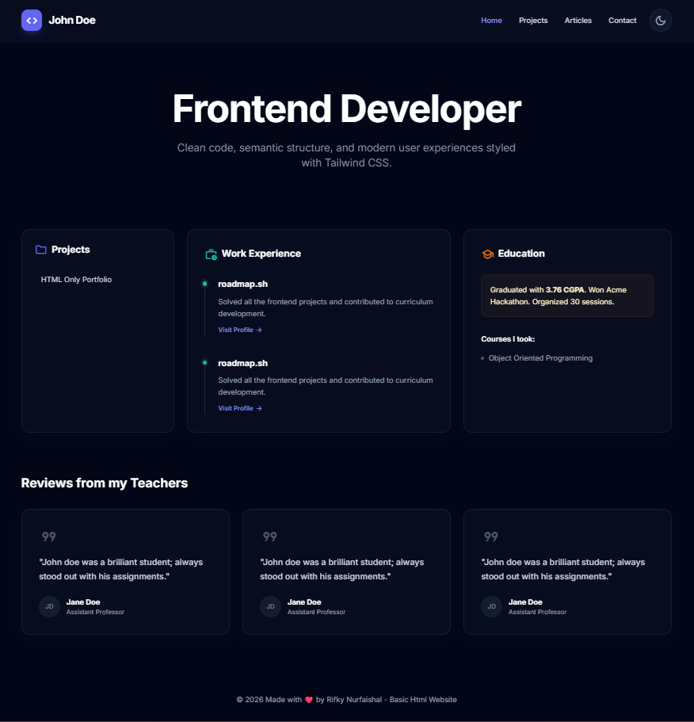
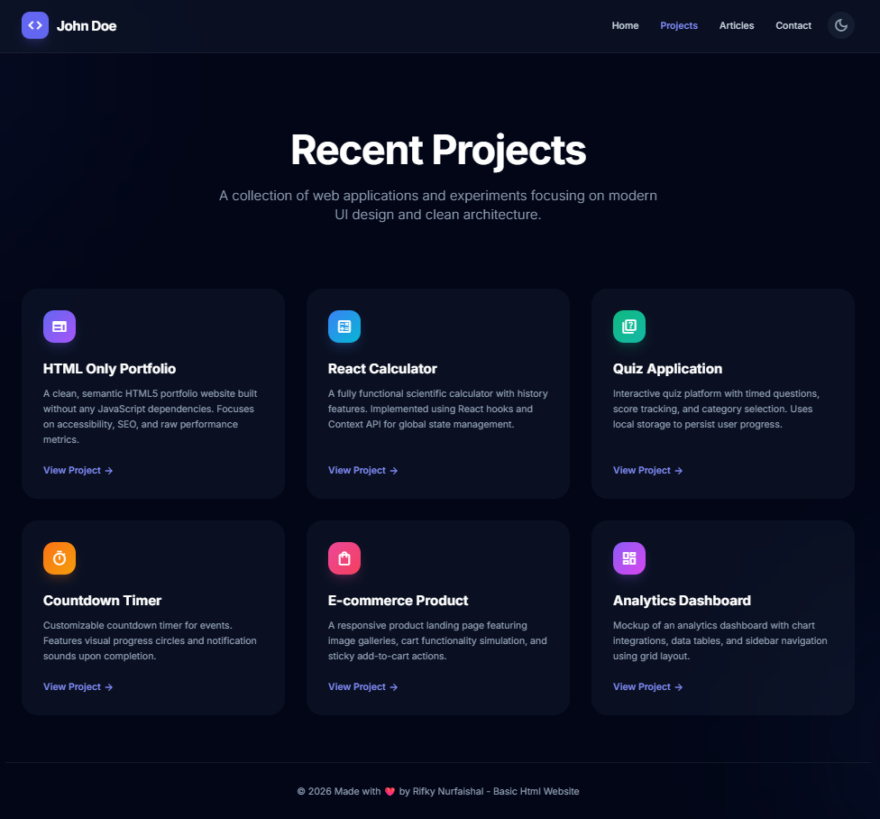
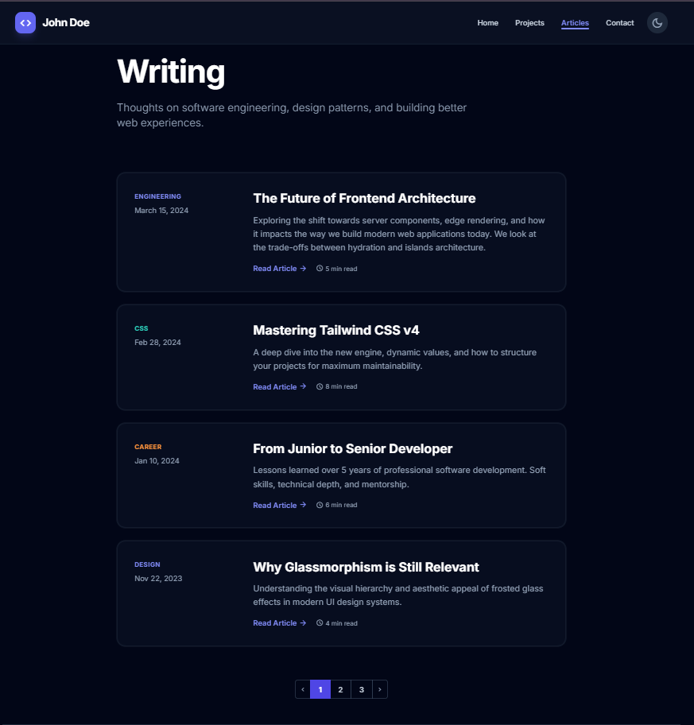
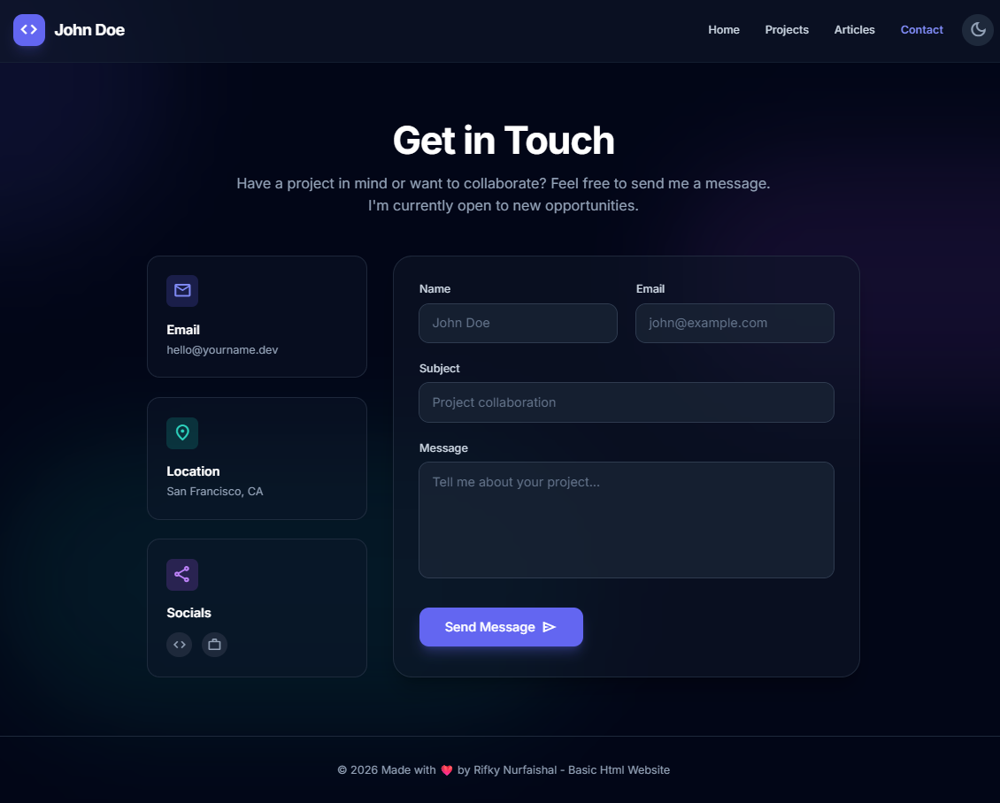

# Modern Developer Portfolio

This project is a solution to the [Basic HTML Website](https://roadmap.sh/projects/basic-html-website) challenge on roadmap.sh.

## 🌟 Overview

A multi-page personal portfolio website built with semantic HTML, Tailwind CSS, and Vanilla JavaScript. It features a modern **Glassmorphism** design, a fully functional **Dark Mode** with local storage persistence, and a clean code architecture separating structure, style, and logic.

## 📸 Screenshots

### 🏠 Home Page & 📂 Projects

<p align="center">
  
  
</p>

### 📝 Articles & 📬 Contact

<p align="center">
  
  
</p>

## 🚀 Features

- **Multi-Page Layout**: Includes Home, Projects, Articles, and Contact pages.
- **Dark Mode**: Toggle between Light and Dark themes (preference saved in LocalStorage).
- **Glassmorphism UI**: Modern frosted glass effects using Tailwind backdrop-blur utilities.
- **Responsive Design**: Fully optimized for mobile, tablet, and desktop screens.
- **Clean Architecture**: Separation of concerns with external CSS and JS files.

## 🛠️ Tech Stack

- **HTML5**: Semantic markup
- **Tailwind CSS (CDN)**: Utility-first styling and responsive design
- **Vanilla JavaScript**: DOM manipulation and theme logic
- **CSS3**: Custom scrollbar styling

## 📂 Project Structure

```text
/
├── index.html        # Home Page
├── projects.html     # Projects Listing
├── articles.html     # Blog/Articles Page
├── contact.html      # Contact Form Page
├── css/
│   └── style.css     # Custom scrollbar styles
└── js/
    └── script.js     # Tailwind config & Dark mode logic
```

## 📦 How to Run

1. Clone this repository:

   ```bash
   git clone https://github.com/rifkynf1/basic-html-website.git
   ```

2. Navigate to the project folder:

   ```bash
   cd basic-html-website
   ```

3. Open `index.html` in your browser (double-click), or use a local server (optional).

### (Optional) Run with Live Server

If you use VS Code, install **Live Server** extension, then right click `index.html` → **Open with Live Server**.

## 🔗 Project Link

- Challenge: [https://roadmap.sh/projects/basic-html-website](https://roadmap.sh/projects/basic-html-website)
- Demo/Repo: [https://github.com/rifkynf1/basic-html-website](https://github.com/rifkynf1/basic-html-website)
